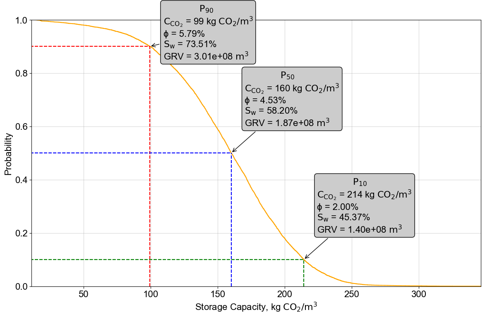
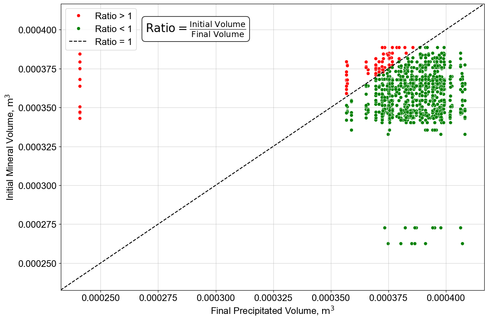

# IFPMin

IFPMin is a Python-based tool designed for simulating and analyzing CO2 storage capacities in geological formations. The tool allows users to generate simulation input files, process simulation results, and perform Monte Carlo analyses for evaluating storage probabilities and capacities.

---

## Features

- **Dynamic Simulation File Generation**: Automatically creates `.inn` simulation input files based on user-provided mineral composition.
- **Data Processing**: Computes various parameters such as initial mineral volume rock and generates porosity, water saturation values to calculate CO2 storage capacity.
- **Visualization**: Includes functionalities for precipitation vs dissolution comparison scatter plots and Monte Carlo analysis on storage capacity plots.
- **Customizable Conditions**: Users can specify temperature, pressure, and other simulation conditions.
- **Monte Carlo Analysis**: Simulates storage scenarios to estimate probabilities for key parameters like P10, P50, and P90.

---

## Installation

1. Clone the repository:
   ```bash
   git clone https://github.com/your-repo/IFPMin.git
   ```
2. Install dependencies:
   ```bash
   pip install -r requirements.txt
   ```

---

## Usage

### Initialization

Import the `IFPMin` class and create an instance:
```python
from IFPMin import IFPMin

model = IFPMin(input_data=input_df, simulation_result=sim_df,
               temperature=50.0, pressure=300.0)
```

### Generate Simulation Files

```python
model.generate_simulation_files(output_dir="Simulation")
```

### Process Simulation Data

```python
processed_data, random_samples = model.process_simulation_data(random_size=1000)
```

### Plot Ratio Comparison

```python
model.plot_ratio_comparison(output_dir="Simulation")
```

### Monte Carlo Analysis

```python
model.MonteCarloStorage(num_simulations=10000, output_dir="Simulation")
```

---

## Visualizations

### Monte Carlo Analysis Plot



The Monte Carlo plot shows the probability distribution of storage capacities with annotations for P10, P50, and P90 values.

---

### Dissolution vs Precipitation Comparison Plot



The scatter plot compares the initial and final mineral volumes with a 45-degree reference line and categorized points.

---

## Customization

### Update Simulation Conditions

Update temperature and pressure dynamically:
```python
model.update_simulation_conditions(temperature=60.0, pressure=350.0)
```

---

## Requirements

- Python 3.7+
- Pandas
- NumPy
- Matplotlib
- Seaborn
- SciPy

---

## Contributing

Contributions are welcome! Please fork the repository and submit a pull request for any improvements.

---

## License

This project is licensed under the MIT License. See the `LICENSE` file for details.

